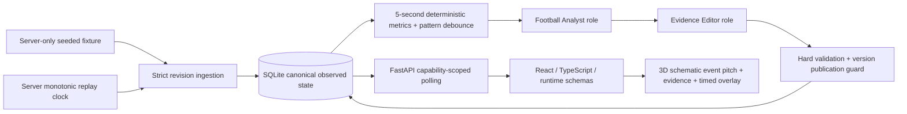

# Local architecture

One Python process, SQLite transactions, polling only. Full fixtures never enter frontend build context. Capability is generated with browser crypto, stored in sessionStorage, sent as Bearer; persist only its hash. Public metadata includes fictional roster but no seed, phase manifest or final result. Generation invalidates restart jobs; data_epoch invalidates corrections; preferences_version invalidates personalized narratives. On recovery, sessions pause. Mock roles are transparent and run without paid services. Optional Microsoft Foundry adapter stays disabled until approved existing resources and cost limits are supplied.

Repository inspected 2026-10-05: empty Git repository, no existing app/instructions/files to preserve. Python 3.12.3, Node 24.13.0, npm 11.6.2 available. Initial installed Python packages: FastAPI 0.115.12, Pydantic 2.11.4, pytest 9.1.1. Blender absent from PATH and standard installation directory.

For the subsequent public-demo refinement, a checksum-verified portable Blender 5.2.2 runtime was downloaded to ignored local tools. It generated the original seating-bowl GLB and editable source; Blender is not required by the deployed app. Public serving is a separately configured bounded mock demo behind same-origin NGINX and NGINX Proxy Manager; see `deployment.md` and `public-demo-backend.md`.
